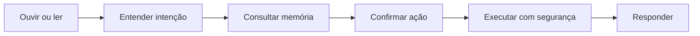

# ZYRON

> **ZYRON Online. Em que posso te ajudar?**

[](https://www.python.org/)
[](https://ollama.com/)
[](https://github.com/leonidas-alt/ZYRON)

O **ZYRON** é um assistente pessoal local com inteligência artificial, criado para conversar, aprender preferências, organizar rotinas e executar automações de forma segura.

O projeto nasceu como um laboratório prático de Python, Programação Orientada a Objetos, arquitetura limpa, inteligência artificial e automação.

A visão de longo prazo é transformar o ZYRON em uma central pessoal capaz de conectar computador, estudos, agenda, música e outros serviços em uma única interface.

> [!IMPORTANT]
> O projeto está em desenvolvimento. A base do modo texto e da integração com o Ollama já foi criada, enquanto memória, comandos, plugins, segurança e voz estão sendo implementados por etapas.

## Visão do projeto

O objetivo é construir um assistente capaz de completar este ciclo:



O ZYRON foi pensado com quatro princípios:

- **Local primeiro:** priorizar processamento e armazenamento no próprio computador;
- **Segurança:** confirmar ações e permitir somente operações conhecidas;
- **Modularidade:** adicionar capacidades sem transformar o projeto em um arquivo gigante;
- **Aprendizado real:** usar cada funcionalidade para estudar desenvolvimento de software na prática.

## Estado atual

| Área | Estado | Descrição |
|---|---|---|
| Estrutura do projeto | Base criada | Organização em camadas e pacote Python configurado |
| Configurações | Base criada | Leitura de variáveis pelo arquivo `.env` |
| IA local | Base criada | Cliente preparado para conversar com o Ollama |
| Interface por texto | Em estabilização | Terminal interativo e encerramento por comandos |
| Roteamento de comandos | Planejado | Identificação de horário, memória, aplicativos e conversa |
| Memória SQLite | Planejado | Persistência de preferências e interações |
| Confirmações e permissões | Planejado | Validação antes de executar ações no computador |
| Sistema de plugins | Planejado | Capacidades independentes e extensíveis |
| Entrada e saída por voz | Planejado | Microfone, Faster Whisper, Edge TTS e reprodução de áudio |
| Integrações externas | Futuro | Calendar, Spotify, Notion, Discord e outros serviços |

## Funcionalidades planejadas

- Conversar em português usando uma IA local;
- responder de forma didática sobre programação e estudos;
- reconhecer comandos por texto e voz;
- guardar e recuperar preferências com SQLite;
- manter o contexto das conversas;
- abrir aplicativos permitidos após confirmação;
- iniciar rotinas de estudo, programação ou jogos;
- informar horário, clima e compromissos;
- integrar Spotify e Google Calendar;
- controlar arquivos, janelas e navegador com regras de segurança;
- funcionar parcialmente offline;
- futuramente conectar computador e celular.

## Arquitetura

O projeto segue conceitos de **Clean Architecture**, **Ports and Adapters** e **injeção de dependência**.

```text
src/zyron/
├── application/       # Casos de uso, comandos, memória e permissões
├── bootstrap/         # Criação e conexão das dependências
├── config/            # Configurações e variáveis de ambiente
├── domain/            # Modelos, contratos, enums e regras centrais
├── infrastructure/    # Ollama, SQLite, voz e recursos do sistema
├── interfaces/        # Interfaces de terminal por texto e voz
├── plugins/           # Capacidades adicionadas ao assistente
└── __main__.py        # Ponto de entrada da aplicação
```

### Responsabilidade de cada camada

| Camada | Responsabilidade |
|---|---|
| `domain` | Define os conceitos e contratos do ZYRON sem depender de tecnologias externas |
| `application` | Coordena o que o assistente deve fazer em cada solicitação |
| `infrastructure` | Implementa detalhes técnicos como Ollama, SQLite, microfone e sistema operacional |
| `interfaces` | Controla a interação do usuário por texto ou voz |
| `plugins` | Reúne capacidades independentes, como abrir um aplicativo ou iniciar uma rotina |
| `bootstrap` | Monta o sistema e injeta as dependências necessárias |

## Tecnologias

- **Python 3.11+** — linguagem principal;
- **Ollama** — execução local do modelo de linguagem;
- **python-dotenv** — carregamento das configurações;
- **Requests** — comunicação HTTP com o Ollama;
- **SQLite** — memória persistente planejada;
- **Faster Whisper** — reconhecimento e transcrição de voz;
- **SoundDevice, NumPy e SciPy** — captura e processamento de áudio;
- **Edge TTS e Pygame** — geração e reprodução da voz;
- **Pytest** — testes automatizados;
- **Ruff** — análise e padronização do código.

## Pré-requisitos

Antes de começar, instale:

- [Git](https://git-scm.com/);
- [Python 3.11 ou superior](https://www.python.org/downloads/);
- [Ollama](https://ollama.com/download).

## Instalação

### 1. Clone o repositório

```bash
git clone https://github.com/leonidas-alt/ZYRON.git
cd ZYRON
```

### 2. Crie e ative o ambiente virtual

No Windows PowerShell:

```powershell
py -m venv .venv
.venv\Scripts\Activate.ps1
```

No Linux, WSL ou macOS:

```bash
python3 -m venv .venv
source .venv/bin/activate
```

### 3. Instale o projeto

Para usar o modo texto e as ferramentas de desenvolvimento:

```bash
python -m pip install --upgrade pip
python -m pip install -e ".[dev]"
```

Para também instalar as dependências preparadas para voz:

```bash
python -m pip install -e ".[voice,dev]"
```

> [!NOTE]
> Instalar as dependências de voz não ativa esse modo automaticamente. A interface por voz ainda faz parte do roadmap.

## Configuração

Crie o arquivo local `.env` usando o `.env.example` como modelo.

No Windows PowerShell:

```powershell
Copy-Item .env.example .env
```

No Linux, WSL ou macOS:

```bash
cp .env.example .env
```

Exemplo de configuração:

```env
ZYRON_ASSISTANT_NAME=ZYRON
ZYRON_OWNER_NAME=Leonidas
ZYRON_LANGUAGE=pt-BR
ZYRON_MODE=text

OLLAMA_BASE_URL=http://localhost:11434
OLLAMA_MODEL=llama3.1
OLLAMA_TIMEOUT_SECONDS=60

ZYRON_DATABASE_PATH=data/zyron.db
```

| Variável | Finalidade |
|---|---|
| `ZYRON_ASSISTANT_NAME` | Nome exibido pelo assistente |
| `ZYRON_OWNER_NAME` | Nome usado para personalizar a conversa |
| `ZYRON_LANGUAGE` | Idioma principal da aplicação |
| `ZYRON_MODE` | Interface utilizada; atualmente use `text` |
| `OLLAMA_BASE_URL` | Endereço local da API do Ollama |
| `OLLAMA_MODEL` | Modelo usado para gerar respostas |
| `OLLAMA_TIMEOUT_SECONDS` | Tempo máximo de espera pela IA |
| `ZYRON_DATABASE_PATH` | Caminho reservado para o banco de memória |

## Preparação do Ollama

Baixe o modelo configurado no `.env`:

```bash
ollama pull llama3.1
```

Caso o serviço do Ollama não esteja ativo, inicie-o em outro terminal:

```bash
ollama serve
```

Você pode trocar o modelo alterando `OLLAMA_MODEL`, desde que ele já esteja instalado no Ollama.

## Execução

Com o ambiente virtual ativado e o Ollama disponível:

```bash
python -m zyron
```

Como o projeto é instalado em modo editável, também poderá ser possível executar:

```bash
zyron
```

Para encerrar a conversa, digite:

```text
sair
encerrar
fechar
exit
quit
```

## Roadmap

### Fase 1 — Fundação

- [x] Criar o pacote Python e a estrutura em camadas;
- [x] configurar variáveis de ambiente;
- [x] criar o cliente do Ollama;
- [x] criar a base da interface por texto;
- [ ] estabilizar a inicialização;
- [ ] adicionar os primeiros testes automatizados.

### Fase 2 — Entender e lembrar

- [ ] implementar matcher, roteador e processador de comandos;
- [ ] criar memória persistente com SQLite;
- [ ] manter o contexto das últimas conversas;
- [ ] criar respostas locais que não dependam do Ollama.

### Fase 3 — Obedecer com segurança

- [ ] classificar ações por nível de risco;
- [ ] solicitar confirmação antes de agir;
- [ ] implementar uma lista de aplicativos permitidos;
- [ ] criar registro e carregamento de plugins;
- [ ] abrir aplicativos sem executar diretamente o texto do usuário.

### Fase 4 — Ouvir e falar

- [ ] capturar áudio do microfone;
- [ ] transcrever português com Faster Whisper;
- [ ] gerar e reproduzir respostas por voz;
- [ ] implementar a interface de voz;
- [ ] adicionar palavra de ativação e escuta contínua.

### Fase 5 — Ecossistema ZYRON

- [ ] criar rotinas de estudo, programação e jogos;
- [ ] integrar Google Calendar e Spotify;
- [ ] controlar navegador, arquivos e janelas;
- [ ] integrar Notion e Discord;
- [ ] criar um dashboard;
- [ ] desenvolver uma conexão futura com celular.

## Segurança

O ZYRON deverá seguir estas regras durante toda a sua evolução:

- Confirmar ações antes de modificar o computador;
- executar apenas aplicativos e comandos presentes em uma lista permitida;
- nunca executar diretamente uma frase transcrita do usuário;
- não acessar senhas ou dados bancários;
- não realizar compras ou pagamentos;
- não desativar mecanismos de segurança;
- não excluir dados permanentemente;
- informar quando uma ação não puder ser realizada.

## Objetivos de aprendizado

Além de construir um assistente pessoal, o projeto será usado para praticar:

- Python e Programação Orientada a Objetos;
- interfaces, classes abstratas e polimorfismo;
- arquitetura limpa e princípios SOLID;
- programação assíncrona;
- bancos de dados e SQL;
- testes automatizados;
- Git e GitHub;
- integração com inteligência artificial local;
- segurança em automações;
- documentação e evolução incremental de software.

## Contribuições e sugestões

O ZYRON é um projeto pessoal e educacional, mas ideias, sugestões e relatos de problemas são bem-vindos.

Utilize as [Issues do repositório](https://github.com/leonidas-alt/ZYRON/issues) para contribuir com a evolução do projeto.

---

Se o ZYRON conseguir **ouvir, entender, lembrar, confirmar e executar**, ele deixa de ser apenas um chatbot e passa a funcionar como um assistente pessoal de verdade.
