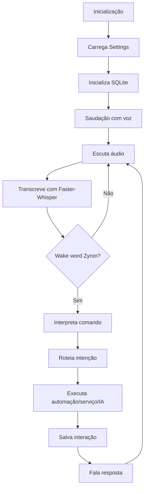
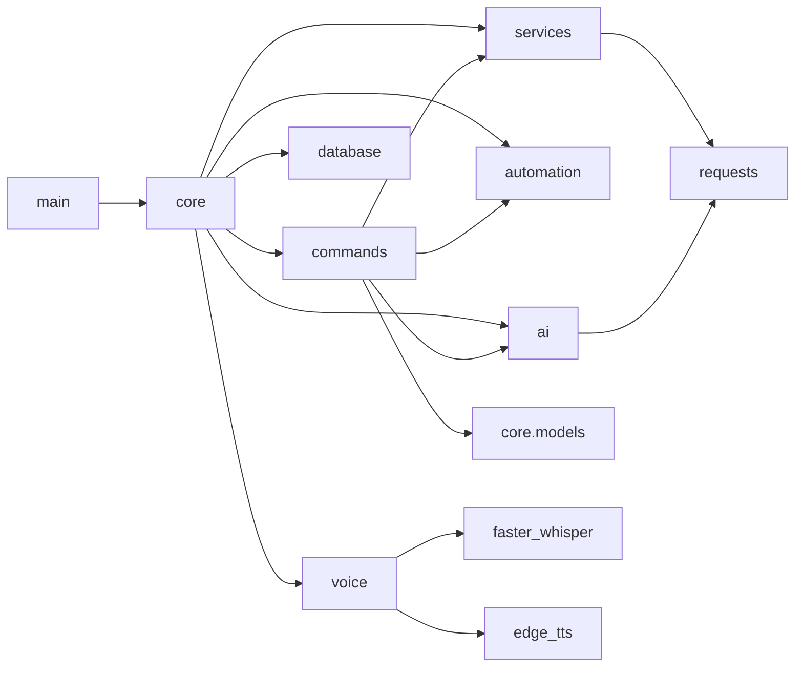

# ZYRON

ZYRON é um assistente virtual local para Windows, inspirado em um Jarvis, desenvolvido em Python 3.12+ com IA local via Ollama.

## Árvore do projeto

```text
ZYRON/
├── main.py
├── core/
│   ├── __init__.py
│   ├── application.py
│   ├── config.py
│   └── models.py
├── ai/
│   ├── __init__.py
│   └── ollama_client.py
├── voice/
│   ├── __init__.py
│   ├── speech_to_text.py
│   ├── text_to_speech.py
│   └── wake_word.py
├── commands/
│   ├── __init__.py
│   ├── command_interpreter.py
│   └── command_router.py
├── automation/
│   ├── __init__.py
│   ├── app_launcher.py
│   └── browser_controller.py
├── services/
│   ├── __init__.py
│   ├── time_service.py
│   └── weather_service.py
├── database/
│   ├── __init__.py
│   └── sqlite_repository.py
├── data/
├── tests/
│   └── test_command_interpreter.py
├── requirements.txt
└── README.md
```

## Responsabilidades das pastas

- `core/`: configuração, modelos de domínio e orquestração principal.
- `ai/`: clientes e componentes de IA local, incluindo Ollama e futura memória vetorial.
- `voice/`: captura, transcrição, wake word e síntese de voz.
- `commands/`: interpretação e roteamento de comandos.
- `automation/`: automação de desktop e navegador.
- `services/`: serviços de horário, clima e futuras APIs externas.
- `database/`: persistência SQLite e base para memória persistente.
- `data/`: arquivos locais gerados em runtime, como banco SQLite.
- `tests/`: testes automatizados.

## Arquivos principais

### `main.py`
Objetivo: ponto de entrada da aplicação. Dependências: `core.application`, `core.config`.

### `core/application.py`
Objetivo: compor dependências, executar saudação inicial e manter o loop em segundo plano. Dependências: módulos de IA, voz, comandos, automação, serviços e banco.

### `core/config.py`
Objetivo: carregar configurações via `.env`. Dependências: `python-dotenv`.

### `core/models.py`
Objetivo: centralizar modelos de domínio (`CommandIntent`, `AssistantResponse`). Dependências: biblioteca padrão.

### `ai/ollama_client.py`
Objetivo: enviar prompts ao Ollama local. Dependências: `requests`.

### `voice/speech_to_text.py`
Objetivo: transcrever áudio com Faster-Whisper. Dependências: `faster-whisper`.

### `voice/text_to_speech.py`
Objetivo: sintetizar respostas com Edge-TTS. Dependências: `edge-tts`.

### `voice/wake_word.py`
Objetivo: detectar e remover a palavra de ativação `Zyron`. Dependências: biblioteca padrão.

### `commands/command_interpreter.py`
Objetivo: converter texto em intenções estruturadas. Dependências: `core.models`.

### `commands/command_router.py`
Objetivo: executar intenções usando o serviço correto. Dependências: IA, automação e serviços.

### `automation/app_launcher.py`
Objetivo: abrir aplicativos instalados. Dependências: `subprocess`.

### `automation/browser_controller.py`
Objetivo: abrir sites e pesquisas no Google. Dependências: `webbrowser`, `urllib`.

### `services/time_service.py`
Objetivo: informar horário atual. Dependências: `datetime`.

### `services/weather_service.py`
Objetivo: informar temperatura atual com OpenWeather. Dependências: `requests`.

### `database/sqlite_repository.py`
Objetivo: preparar SQLite para histórico e memória persistente. Dependências: `sqlite3`.

## Fluxo do sistema



## Dependências entre módulos



## Configuração

Crie um arquivo `.env` opcional:

```env
ZYRON_OWNER_NAME=Leonidas
OLLAMA_BASE_URL=http://localhost:11434
OLLAMA_MODEL=llama3.1
OPENWEATHER_API_KEY=sua_chave
OPENWEATHER_CITY=Sao Paulo
```

## Execução

```bash
python -m venv .venv
.venv\Scripts\activate
pip install -r requirements.txt
python main.py
```
